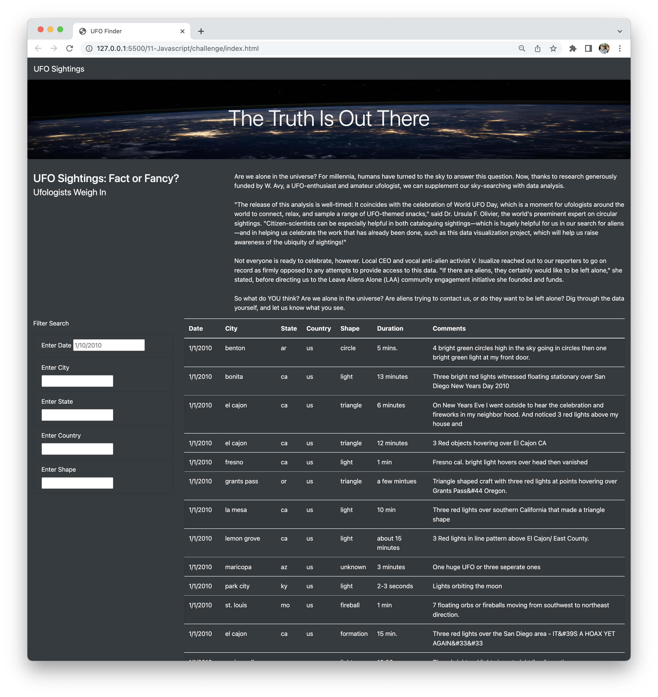
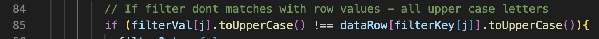
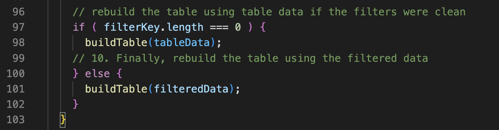

# UFOs
Challenge 11

## Overview of Project:

Dana is a Data Jornalist who wanted to tell a story about her hometown McMinnville, Oregon. Her hometowns is famous for UFOs sightings and even has a gathering of UFOs enthusiastics. For this project we will be using a JavaScript file (data.js) filled with sightings informations. 

The plan is to build a webpage that will present an article and a dynamic table with all the information inside the JavaScript file. And to make this table fully dynamic, meaning that it will react to user input, we will create filters allowing users to filter for multiple criteria at the same time. The filters we will be using are: date, city, state, country, and shape. Then we'll place the table into an HTML file for easy viewing. The webpage will be customize using Bootstrap.

## Results: 

The Webpage is simple to use. Lets say we want to know about the followwing UFO sighting:
city: el cajon
shape: light
date: 1/1/2010
We would fill in the filters one at time and press enter, and the website will automatically start filtering step by step.

Figure 1: This image shows the city and the shape already filtered.

Figure 2: This image shows the city already filtered.

Figure 3: This image shows the city and the shape filtered.

Figure 4: This image shows the city, the shape and the date filtered.

## Summary:

During the implementation of this project I encountered some problems, two of them I corrected in this version, as I would consider them bugs. The other three problems I am recommending to implement in the next version.

 1. [Problem] When I was filtering the city and added a upper case letter to the city name, the filter wouldn't return the expected results.

    [Correction] I transformed the string all in upper case to compare.
     
    [When] This version

2. [Problem] The next problem found was if I cleared the filter, the table wouldn't rebuild.

    [Correction] I inserted in the code a test to see if the filterKey length is 0 and if it is, I rebuild the table with the whole data.
    

    [When] This version

3. [Problem] There are no buttons to clear the data with only one click. You have to mannually delete the values from the textbox and click enter.

    [Correction] Implement a button that clears all filters with only a click.

    [When] Next version

4. [Problem] The table can not be sorted by any column.

    [Correction] Implement a sort solution that alows the user to sort the table by any column.

    [When] Next version

5. [Problem] You have to press enter to filter the data.
    
    [Correction] Implement a correction to the event to listen for changes as the user types to each filter.
    
    [When] Next version
